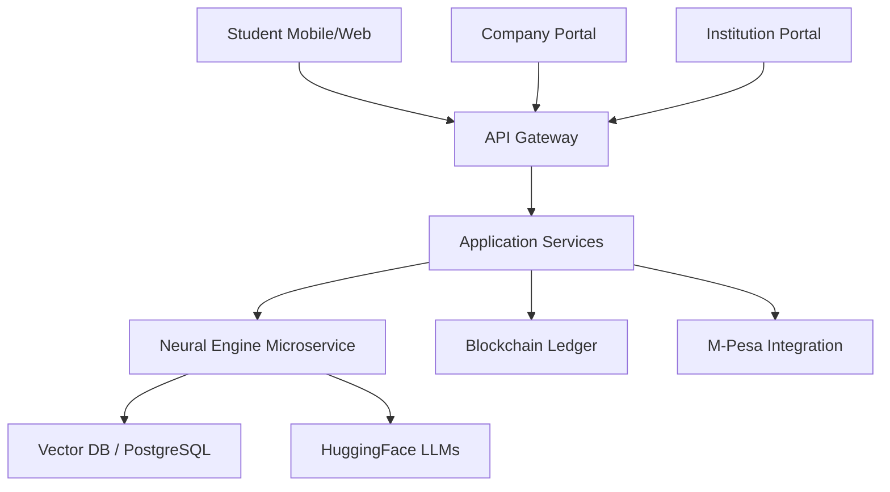

# 🤖 AISHA: AI-Powered Industrial Attachment Matching Platform

<div align="center">
  
  <br />
  <p align="center">
    <b>Revolutionizing the future of industrial placements through Intelligence & Automation.</b>
  </p>
  
  [](file:///home/wakanda_forever/Desktop/AISHA/ai-services)
  [](file:///home/wakanda_forever/Desktop/AISHA)
  [](file:///home/wakanda_forever/Desktop/AISHA)
</div>

---

### 🌟 Vision
**AISHA** (AI-Powered Industrial Attachment Matching Platform) is an intelligent, end-to-end digital ecosystem designed to revolutionize how university and college students in Kenya connect with companies for industrial attachment opportunities. By harnessing **Artificial Intelligence**, **Machine Learning**, and **Process Automation**, AISHA eliminates the manual, paper-heavy, and corruption-prone procedures that have historically plagued the attachment placement process.

---

### ⚡ Intelligence & Automation Hub
> [!NOTE]
> **Autonomy & Reasoning:** AISHA doesn't just match; it *reasons*. Utilizing a **Multi-Agent Chief Autonomy System**, it analyzes transcripts, interests, and company requirements for the "Single Best Match".

<div align="center">
  
</div>

#### **Key Neural Components:**
*   **🧠 Matchmaking Engine:** Deep-learning vector similarity matching between student profiles and company opportunities.
*   **📄 Document Intelligence:** Automated generation of NITA forms, attachment letters, and insurance covers.
*   **🛰️ Real-time Insights:** Instant reasoning for *why* a student was matched to a specific role.
*   **💬 AISHA Chatbot:** A GPT-powered assistant for students to navigate the application lifecycle.

---

### 🛠️ Technology Stack

| Layer | Technologies |
| :--- | :--- |
| **Frontend** | React 18, TypeScript, Tailwind CSS, Framer Motion |
| **Backend** | Node.js, Express, PostgreSQL, Redis |
| **AI/ML** | Python, FastAPI, HuggingFace, Scikit-Learn |
| **Mobile** | React Native, Expo |
| **Infrastructure** | Docker, Nginx, GitHub Actions |
| **Payments** | M-Pesa Daraja 2.0 Integration |

---

### 🏗️ System Architecture


---

### 👥 Development Team

<div align="center">
  <h3>✨ The Minds Behind AISHA ✨</h3>
</div>

| Name | Role | Focus Area |
| :--- | :--- | :--- |
| **Brian Ndinya** | **Team Lead & Lead Developer** | System Architecture, Neural Matchmaking, Chief Autonomy Engine |
| [Placeholder Name] | Developer | Frontend / UI Architecture |
| [Placeholder Name] | Developer | Backend & API Design |
| [Placeholder Name] | Developer | Mobile Solutions |

---

### 🚀 Getting Started

1.  **Clone the Repository:**
    ```bash
    git clone https://github.com/SirNdinya/AISHA.git
    cd AISHA
    ```
2.  **Environment Setup:**
    ```bash
    bash setup.sh
    ```
3.  **Launch Infrastructure:**
    ```bash
    docker-compose up -d
    ```

---

<div align="center">
  <p><b>Developed with ❤️ for the Kenyan Education & Employment Ecosystem</b></p>
  <p>© 2026 AISHA Project Team. All Rights Reserved.</p>
</div>
