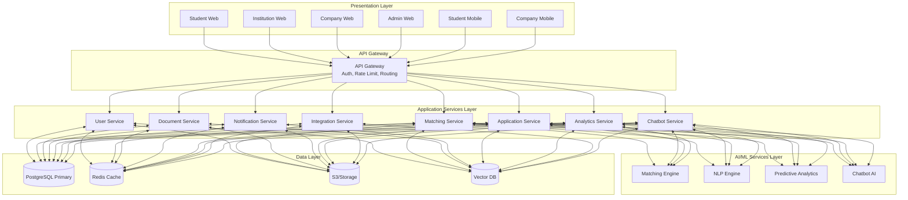
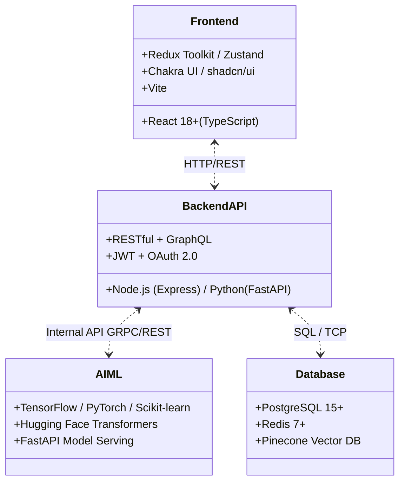
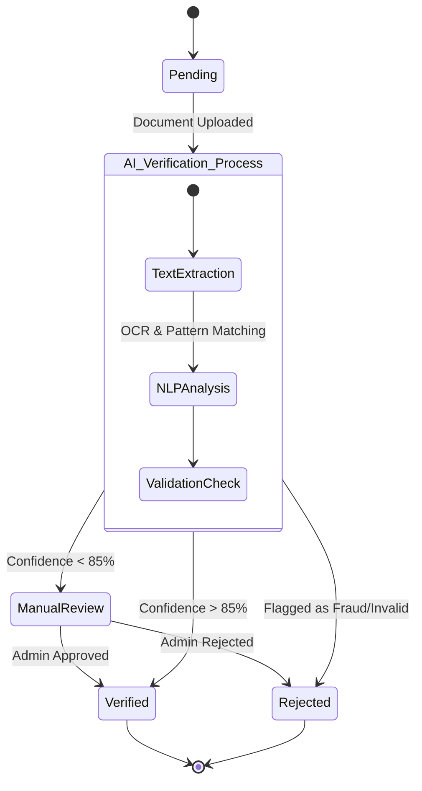

# AISHA: Software Design Document (SDD) & Architecture

This document contains the comprehensive system design for the AISHA (AI-Powered Industrial Attachment Matching Platform) project, including architectural diagrams, component relationships, and database Entity-Relationship Diagrams (ERDs).

## 1. System Conceptual Diagram

## 2. Component Architecture Diagram

## 3. Entity-Relationship Diagram (ERD)

```mermaid
erDiagram
    USERS ||--o{ INSTITUTIONS : "has (1:1)"
    USERS ||--o{ COMPANIES : "has (1:1)"
    USERS ||--o{ STUDENTS : "has (1:1)"
    USERS ||--o{ AUDIT_LOGS : "generates"
    USERS ||--o{ NOTIFICATIONS : "receives"
    
    INSTITUTIONS ||--o{ STUDENTS : "enrolls"
    INSTITUTIONS ||--o{ DEPARTMENTS : "contains"
    
    COMPANIES ||--o{ OPPORTUNITIES : "posts"
    
    STUDENTS ||--o{ APPLICATIONS : "submits"
    STUDENTS ||--o{ STUDENT_LEARNING_PROGRESS : "tracks"
    
    OPPORTUNITIES ||--o{ APPLICATIONS : "receives"
    OPPORTUNITIES ||--o{ PAYMENTS : "generates"
    
    LEARNING_RESOURCES ||--o{ STUDENT_LEARNING_PROGRESS : "used_by"
    
    USERS {
        uuid id PK
        string email
        string password_hash
        enum role
        boolean is_verified
    }
    
    STUDENTS {
        uuid id PK
        uuid user_id FK
        string admission_number
        jsonb skills
        jsonb interests
    }
    
    COMPANIES {
        uuid id PK
        uuid user_id FK
        string name
        string industry
        string location
    }
    
    INSTITUTIONS {
        uuid id PK
        uuid user_id FK
        string name
        string code
    }
    
    OPPORTUNITIES {
        uuid id PK
        uuid company_id FK
        string title
        string description
        numeric stipend_amount
        string status
    }
    
    APPLICATIONS {
        uuid id PK
        uuid student_id FK
        uuid opportunity_id FK
        numeric match_score
        string status
    }
    
    PAYMENTS {
        uuid id PK
        uuid student_id FK
        uuid opportunity_id FK
        uuid company_id FK
        numeric amount
        string status
    }
```

## 4. Document Hub & AI Document Verification Diagram

## 5. Software Design Conclusion

- **Design Pattern**: Microservices Architecture
- **Multi-Tenancy**: Handled via schema separation per institution (`inst_[slug]`) ensuring institutional data isolation and performance optimizations for academic units tracking.
- **AI Matching**: XGBoost/LightGBM model fed by parsed resumes (`resume_text`), students' `skills`, and opportunity requirements.
- **Payments Integration**: Tightly coupled with the M-Pesa API to distribute stipends to student endpoints efficiently.
