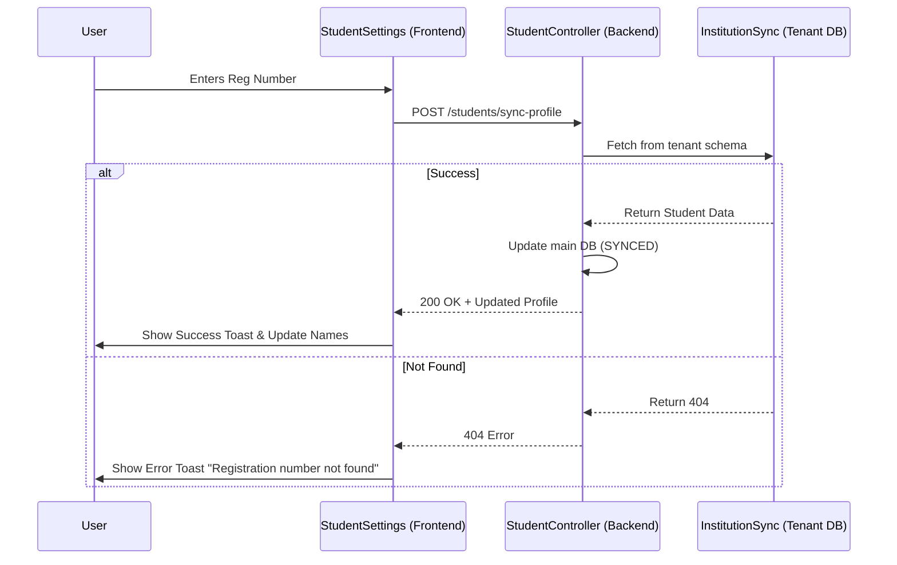

# AISHA Logic Flows

This document contains visual representations of key system logic flows using Mermaid diagrams.

## 1. Student Registration Sync (Institutional Database)

This flow illustrates how the system synchronizes student identity data from an institutional database (tenant schema) using a registration number.

