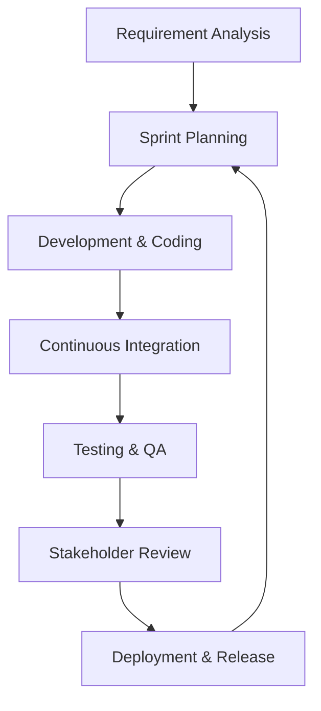

# CHAPTER 3: METHODOLOGY AND SYSTEM ANALYSIS

## 3.1 The Agile Development Philosophy and Scrum Framework
The development of the AISHA platform was not a linear process but rather a highly iterative journey that utilized the Agile Development Methodology, specifically the Scrum framework. This choice was driven by the inherent complexity of the project, which required the seamless integration of multiple third party technologies such as the Google Gemini AI, the Safaricom Daraja API for M Pesa, and the Gmail API for institutional communications. Because these technologies often have their own unique constraints and "edge cases," the Agile approach allowed us to remain flexible and responsive to technical challenges as they arose. We structured our work into two week "Sprints," each of which began with a rigorous planning session where we identified specific user stories and functional goals to be achieved. Throughout each sprint, we maintained constant communication to identify potential blockers such as the early discovery that Render’s ephemeral disk policy would wipe our local files and we held retrospective meetings at the end of each cycle to analyze our progress and refine our strategy for the next phase. This iterative loop ensured that the final deliverable was not just a piece of software that met a checklist, but a robust platform that had been battle tested through multiple cycles of development, feedback, and refinement.

## 3.2 Visualizing the SDLC Model
To ensure that all stakeholders understood our development journey, we mapped our progress against a specialized Agile SDLC model. This model illustrates the continuous loop of design, development, and testing that allowed us to deliver a high quality platform in a condensed timeframe.

## 3.3 Comprehensive System Analysis and Stakeholder Engagement
Before a single line of code was written, we conducted a thorough system analysis to understand the deep seated needs of our diverse user base. This involved a detailed stakeholder analysis where we identified the primary actors in the AISHA ecosystem: the student, the university attachment coordinator, the company supervisor, and the system administrator. For the student, the primary need was a simple, mobile accessible interface that could automate the exhausting task of searching for placements and managing mandatory paperwork. For the university coordinator, the focus was on high level oversight the ability to see every active student at a glance and audit their professional progress without the need for constant physical travel. The company supervisor required a tool that was low friction, allowing them to review talent and sign off on daily tasks with minimal administrative overhead. Finally, the system administrator required a robust set of tools for monitoring system health, managing AI API quotas, and ensuring the overall security of the platform.

Our feasibility study further validated that the project was not only technically possible but also operationally and economically viable. From a technical standpoint, we proved that modern Large Language Models like Google Gemini could indeed handle the complex semantic matching required to align diverse student transcripts with departmental needs. Operationally, our engagement with the academic staff at Masinde Muliro University confirmed that there was a massive demand for a platform that could digitize the paper heavy and fragmented attachment process. Economically, by leveraging cloud native services like Supabase and Vercel, we were able to build a professional grade platform with a scalable cost structure that could easily accommodate the growth of the student population over time.

## 3.4 The Intelligent Matching Workflow and 24 Hour Window
The core innovation of the AISHA platform lies in its "Single Match" philosophy, which replaces the overwhelming and often biased multi-choice job boards of the past. When a student initiates a matching request, the AI engine performs an exhaustive analysis of their academic profile and returns only one result: the absolute "Best Fit" placement. This approach ensures that students are not paralyzed by choice and that every recommendation is backed by a high degree of technical confidence. Once this match is presented, a 24 hour "Preference Window" is opened. During this time, the student has the opportunity to review the placement and, if they feel a misalignment exists, they can adjust their professional preferences or update their skill profile. If the student makes no changes within this 24 hour window, the system automatically proceeds with the placement, initiating the autogeneration of the necessary Acceptance letters. This streamlined workflow ensures rapid placement while still providing the student with a critical window of agency and control over their professional journey.

## 3.5 Technical Deviations and Architectural Pivots
One of the most important aspects of our methodology was our willingness to pivot when real world testing revealed weaknesses in our initial plan. For instance, our original proposal considered using a local Ollama model as a fallback to keep data on site. However, as development progressed, we discovered that the Render free tier environment could not support the heavy resource requirements of a localized Large Language Model. We therefore pivoted to a more robust "Cloud Primary" strategy, focusing entirely on optimizing our interaction with the Google Gemini API. This move allowed us to reallocate our system resources towards improving the accuracy of our semantic matching and the speed of our document automation services.

Similarly, our initial attempt to store student documents and photos on the local server's disk was quickly abandoned when we realized that Render’s server restart policy would wipe the ephemeral filesystem daily. We successfully transitioned to Supabase Storage, a move that provided the permanent, bucket based persistence required for institutional records. We also moved away from traditional SMTP email servers, which often struggle with deliverability, and instead integrated the Gmail API through the Google Cloud Console. This ensured that every critical notification from AISHA whether it was a placement approval for a student or a security alert always reached the user's primary inbox, solving the deliverability issues that have plagued university systems for years.

## 3.6 The Role of Supervisory Guidance: Insights from Dr. Charles Muango
The technical and administrative direction of the AISHA project was profoundly influenced by our intensive consultations with Dr. Charles Muango. As the Industrial Attachment Coordinator for Masinde Muliro University of Science and Technology (MMUST), Dr. Muango provided a level of practical insight that no textbook or online tutorial could offer. He helped us understand that the attachment process is not just about finding a job; it is about a complex web of academic oversight and professional verification. It was Dr. Muango who emphasized the critical importance of a tamper proof digital logbook and a clear hierarchical signing precedence where the student’s entry must be verified by the company supervisor before it can even be audited by the university. His guidance ensured that we weren't just building a "cool tech tool," but rather a rigorous administrative platform that solves the actual problems faced by the coordinators at MMUST. He pushed us to consider how the platform could automate the generation of acceptance letters and assignment documents, leading directly to our current high-speed document pipeline.
