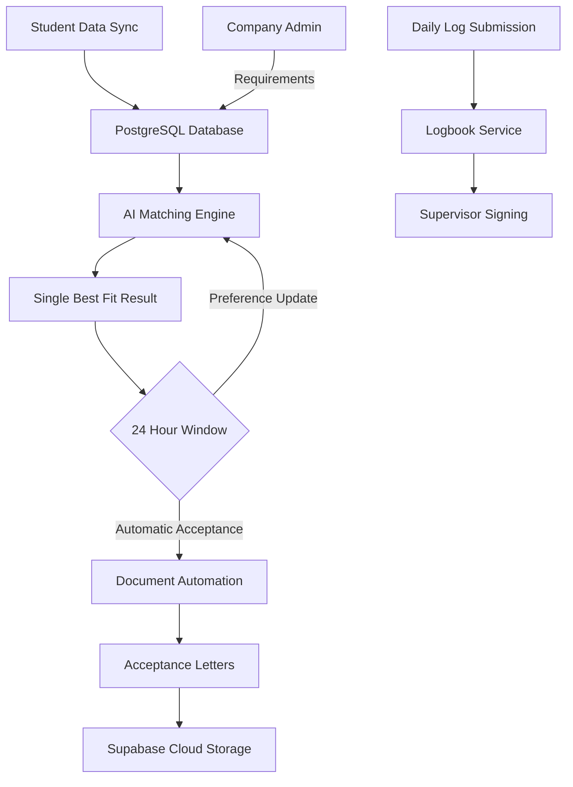
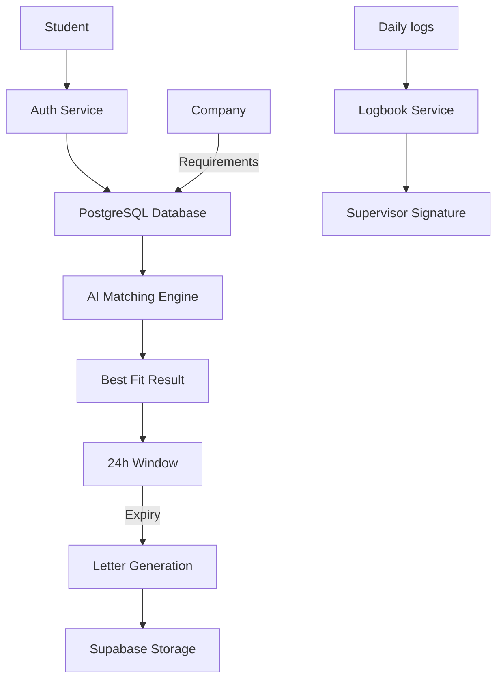
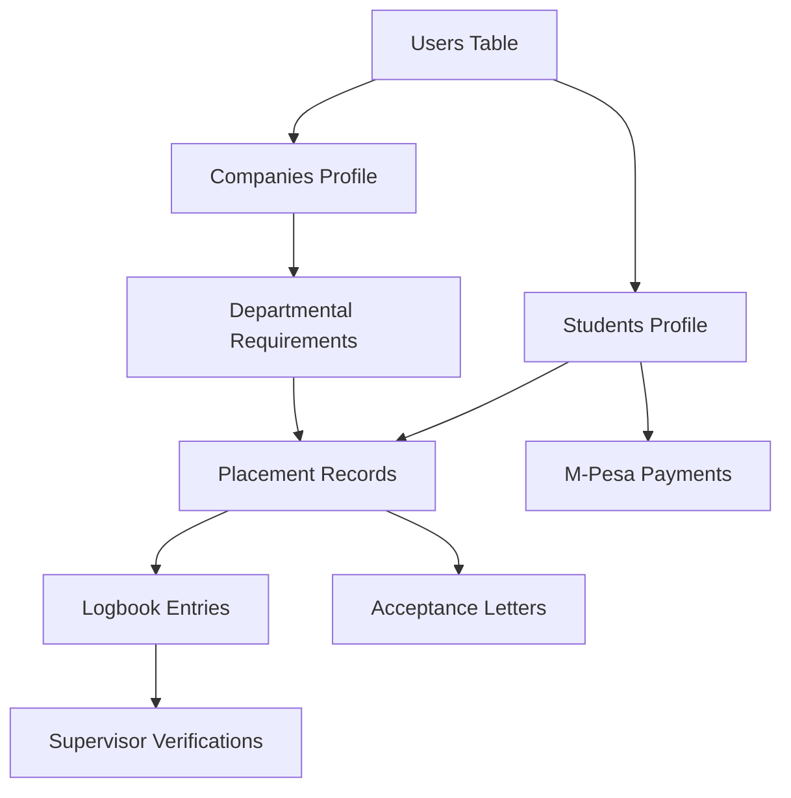

# CHAPTER 4: SYSTEM DESIGN AND ARCHITECTURE

## 4.1 The Decoupled High Availability Architecture
The AISHA platform is built upon a modern, decoupled architecture that was specifically designed to ensure both modularity and high availability. We chose a Model View Controller (MVC) pattern for our backend service to maintain a clean separation of concerns between our data logic, our business rules, and our API endpoints. For the frontend, we utilized a component based architecture which allows us to reuse UI elements across the different dashboards for students, companies, and institutions. This architectural decision was critical because it allowed our team to work on the AI matching logic independently of the user interface, ensuring that a change in one layer did not cause an unexpected failure in another. By hosting our frontend on Vercel and our backend on Render, we were able to create a globally distributed system that remains responsive even as the student population scales.

## 4.2 Visualizing Stakeholder Interactions: Use Case Diagram
To understand the functional scope of the platform, we developed a comprehensive Use Case Diagram that maps the logical flow of data and stakeholder interactions. This visual model identifies the primary roles within the AISHA ecosystem and the specific system features they are authorized to interact with, providing a clear map of our role based access control logic.

## 4.3 Data Flow and Logical Processing: DFD Level 1
The following Data Flow Diagram (DFD) illustrates how information moves through the AISHA system, from the initial input of student data to the generation of final professional records. It highlights the central role of our AI services and our cloud storage layers in the overall data lifecycle, ensuring that every step of the attachment process is documented and verifiable.

## 4.4 The Database Blueprint: Entity Relationship Diagram (ERD)
The core of AISHA’s data integrity lies in its highly normalized PostgreSQL schema. The following ERD shows the relationships between our primary tables, ensuring that every professional record is linked back to a verified student and a specific industrial opportunity.

## 4.5 Tripartite Design and Responsive User Interfaces
At the heart of the AISHA design philosophy is the need to serve three very different groups of users with a single, unified experience. We utilized the Chakra UI design system to build a "Single Page Application" (SPA) that feels fluid and modern. Every interface was designed to be "mobile first," a requirement that Dr. Charles Muango emphasized as critical for students who may be logging their progress from remote industrial sites where they only have access to a smartphone. We used custom theme tokens to support both Light and Dark modes, ensuring that the platform remains readable in any lighting environment. This focus on "responsive aesthetics" was about ensuring that the platform was accessible to every user, regardless of their hardware or their physical environment.

To manage the complex internal state of these interfaces such as the real time matching scores or the status of a pending M Pesa transaction we implemented Redux Toolkit. This allowed us to maintain a "Single Source of Truth" within the frontend application, preventing the UI from getting "out of sync" with the backend database. When a student receives an approval from a company, the notification is pushed to their dashboard via WebSockets (using Socket.io) and the Redux state is updated instantly, providing a seamless and professional experience that rivals established global career platforms.

## 4.6 The Time Compressed Simulation Strategy
Because the full lifecycle of an industrial attachment spans several months, we had to develop an advanced "Time Compressed Simulation Strategy" to verify that every part of the AISHA architecture was ready for production. We populated the platform with hundreds of "Mock Entities" simulated students, fake companies, and automated supervisors to see how the system would behave over a simulated three month period. We wrote scripts that acted as mock supervisors, "signing off" on student logbook entries every few hours to simulate the daily progress of dozens of students simultaneously. This allowed us to verify our "Signing Precedence" logic and ensure that our automated archiving service could correctly bundle hundreds of entries into a single, clean PDF at the end of the simulated term.

We also conducted "Stress Tests" within this simulated world to identify potential bottlenecks. We simulated a scenario where 500 students requested AI matches at the exact same second, allowing us to monitor our Gemini API quota usage and fine-tune our Redis caching strategy. We even performed "Chaos Engineering" tests where we force restarted our backend servers during heavy file uploads to confirm that our migration to Supabase Storage had indeed solved the data loss issues we faced in our early development. This rigorous simulation based approach allowed us to identify and fix technical flaws months before the platform would ever see its first real student from Masinde Muliro University.

